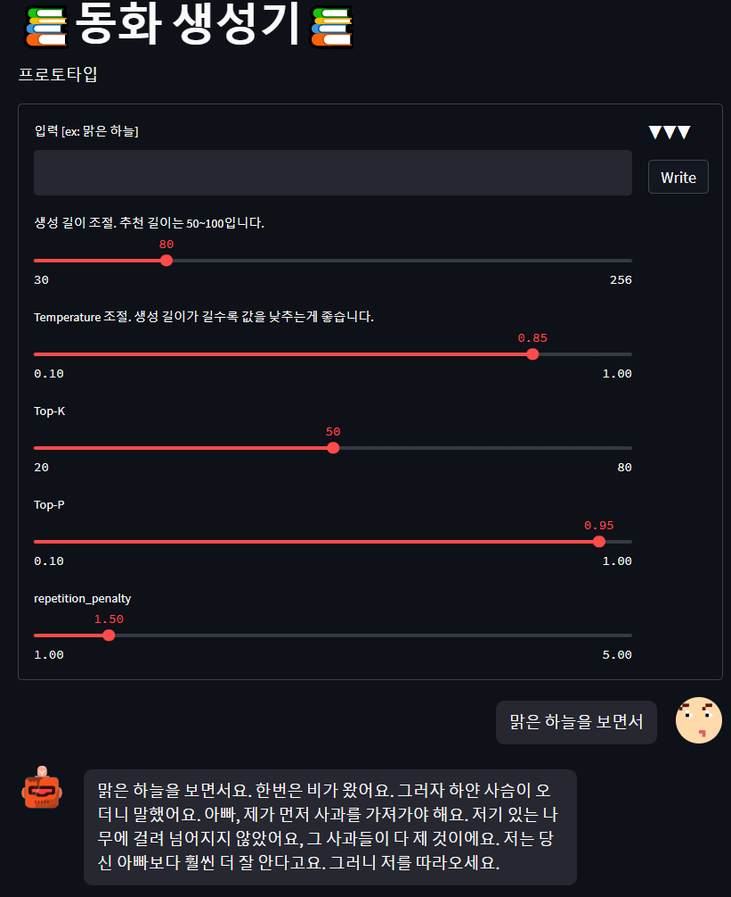

# Streamlit

> `Streamlit`은 Python 기반의 프로토타이핑 도구입니다. 빠르고 쉽게 모델의 프로토타이핑을 구현할 수 있습니다!

저희 조에서는 프로젝트의 가장 핵심 기능인 `문장 생성`기능의 테스트를 위해 Streamlit으로 프로토타입을 구축하였습니다. 이후 팀 내부 테스트와 필드 테스트를 거쳐 모델의 평가를 수집하였습니다!

정량적인 측정이 불가능한 만큼 불특정 다수의 의견이 필요하였습니다. 이에 팀 내부에서 테스트를 끝내는데 그치지 않고, `서울 국제 도서전`과 `부스트캠프 슬랙 채널` 등 여러 채널을 통해 최대한 많은 사람들에게 테스트를 부탁드렸습니다.

테스트 이후 설문조사를 통해 모델의 성능에 대한 사람들의 평가를 통해 모델 및 프로젝트의 개선 방향을 잡을 수 있었고, 내부 테스트에서는 미처 찾지 못 한 버그도 찾아낼 수 있었습니다.

해당 설문조사 결과 및 리포트는 [링크](https://melodious-typhoon-a32.notion.site/07913b1c9ce4402ea083c0392f152f51)에서 보실 수 있습니다.
